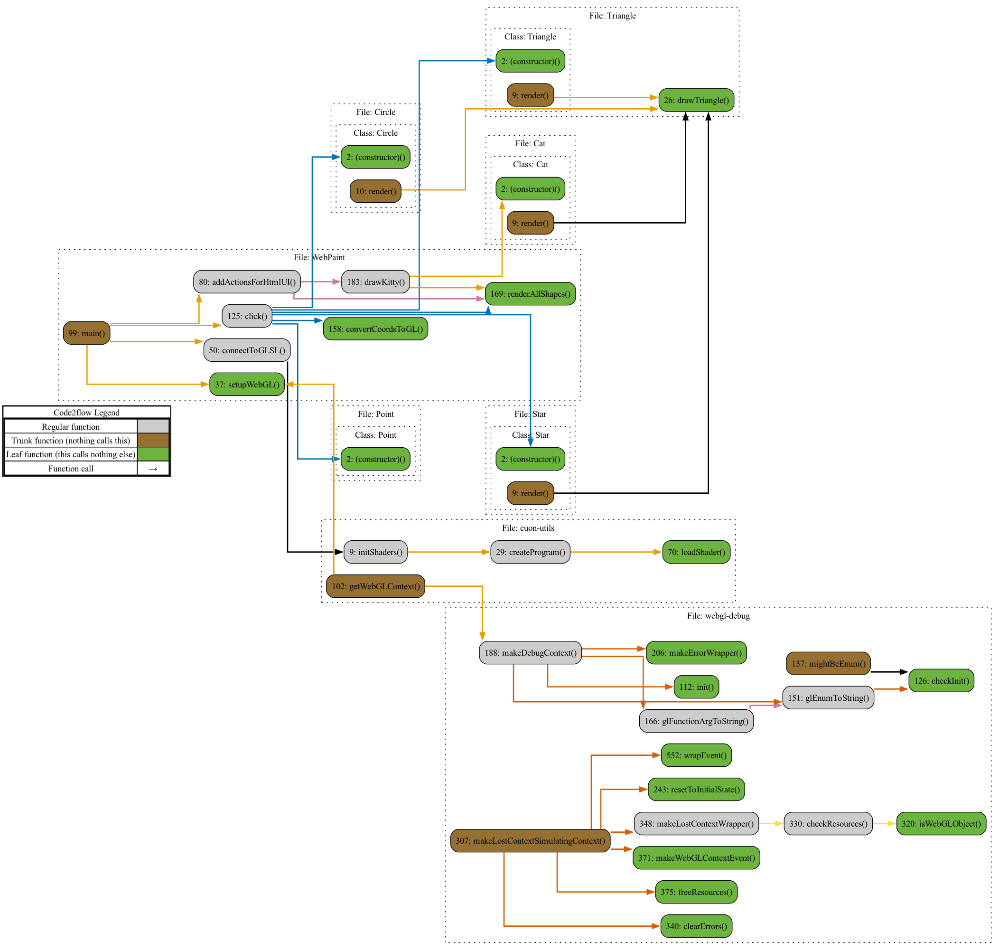

# Module Overview: Cat.js

## Primary Objectives:
The purpose of this module is to define a Cat class and its associated methods for rendering a cat shape using WebGL.

## Critical Functions:
1. constructor(): Initializes the Cat object with default values for its type, position, color, and size.
2. render(): Draws the cat shape using WebGL by calling various drawTriangle() functions with specific coordinates and colors.

## Key Variables:
1. type: Represents the type of the cat.
2. position: An array storing the x, y, and z coordinates of the cat's position.
3. color: An array representing the RGBA color values of the cat.
4. size: Specifies the size of the cat.

## Interdependencies:
This module relies on WebGL and assumes the existence of functions like gl.uniform4f() and drawTriangle() for rendering.

## Core vs. Auxiliary Operations:
The core operation of this module is the render() function, which is responsible for drawing the cat shape using WebGL. The constructor() function is an auxiliary operation that initializes the cat object with default values.

## Operational Sequence:
The module does not have a distinct operational sequence. It consists of a Cat class with a constructor and a render function that can be called independently.

## Performance Aspects:
The performance of this module may depend on the efficiency of the WebGL rendering process. The number of drawTriangle() calls and the complexity of the cat shape may also impact performance.

## Reusability:
This module can be reused to render cat shapes in different WebGL applications. The Cat class can be instantiated with different parameters to create multiple cat instances with varying positions, colors, and sizes.

## Flow Map (Js)

